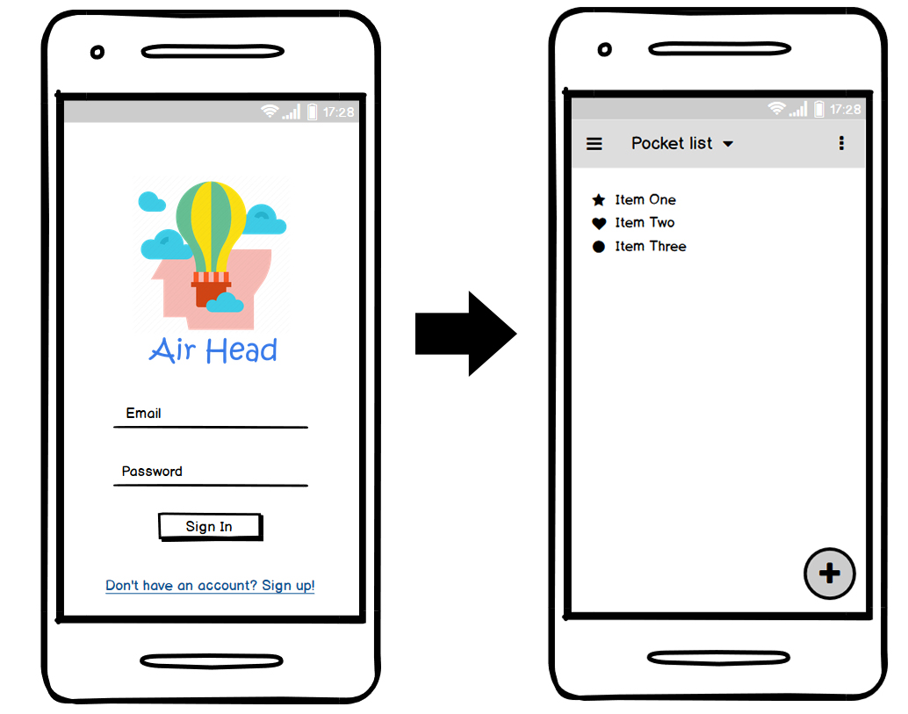
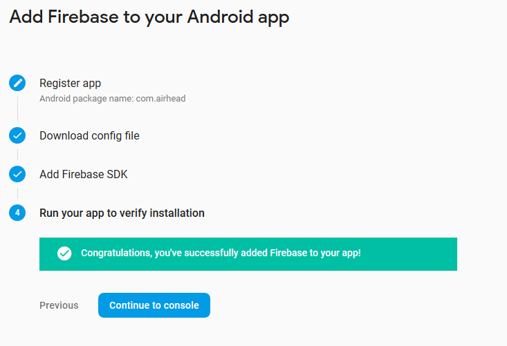

# AirHead
An organization app that warns you once you leave your house if you have all the items you need with you.

It works by sending you a notification once you lose the wifi connection as you leave your house. So, unless you forgot your keys, you can come back for the other items!

# Table of Contents

- [Technology Used](#technology-used)
- [Instalation](#instalation)
- [Mockup](#mockup)
- [Software Specification](#software-specification)
- [Intermediate Attempts](#intermediate-attempts)
- [Author Comment](#author-comment)

## Technology Used
1. [React Native](https://facebook.github.io/react-native/)
2. Other 3rd party modules referred in the package.json file

## Instalation
There is a file in the `AirHead/_APK` folder that can be transfered to the mobile device and directly installed (provided there is an installer installed).
Alternatively the repository can be cloned and it's possible to compile the app yourself with react-native and npm. Running `npm install` will install the required modules and `react-native run-android` will run it if a device is ready.

Important note: For security reasons configuration files (namely firebase) have been ommited from the git repository.

## Mockup

    

## Software Specification
The main interface of the application consists of a list of items that the user owns and wants to keep a reminder of. The user can add other items or remove them from their list as they so desire. The application is supposed to validate the user authentication from a FireBase database. Once the application loses connection to wifi, it sends an notification to the user for them to check if they forgot any item as they are leaving their home.
The flow of events is such: the user logs into the app, adds/removes the items they want to be reminded of. After this set up the user no longer needs to do anything else. As the user leaves their home, the app will detect a loss of wifi connection and send the notification to the user. Which in turn will check their pockets and confirm with the notification.

## Intermediate attempts
The app was able to connect to FireBase, even though executing the functions wasn't successful. The green message box shows after the FireBase servers are able to connect to the app running (in development).

    

A login screen was also implemented but it was commented for the sake of making a release of the .apk file. Ultimately the login screen didn't work because the FireBase functions not behaving as expected.

    

## Author Comment
Miguel Sluijs b113436

This was my first experience with react-native and it was no easy task. The modules become outdated quite quick and whatever examples are used as a reference won't even compile straight from other repositories. The project doesn't meet its own requirements, however, an attempt was made to explore the framework and the problems and advantages that arise from it. The project development stopped to a halt when firebase functions weren't being called properly and react-native-elements kept throwing errors on the node console about non-existent directories.

